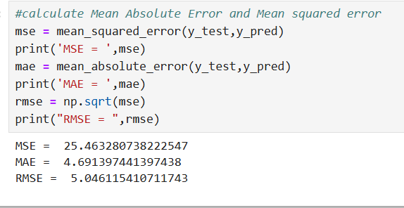

# Implementation-of-Simple-Linear-Regression-Model-for-Predicting-the-Marks-Scored

## AIM:
To write a program to predict the marks scored by a student using the simple linear regression model.

## Equipments Required:
1. Hardware – PCs
2. Anaconda – Python 3.7 Installation / Jupyter notebook

## Algorithm
Step 1: Collect Data
Gather data on study hours (X) and marks scored (Y).
Step 2: Preprocess Data
Clean data, handle missing values, and split into training/testing sets.
Step 3: Train Model
Apply linear regression on X_train and Y_train.
Step 4: Make Predictions
Use the model to predict marks on X_test.
Step 5: Evaluate Model
Compare predicted marks with actual marks to assess accuracy.

## Program:
```
Program to implement the simple linear regression model for predicting the marks scored.
Developed by: SARANYA S.
RegisterNumber:  212223220101

CODE:

import pandas as pd
import numpy as np
import matplotlib.pyplot as plt
from sklearn.metrics import mean_absolute_error, mean_squared_error
df=pd.read_csv("student_scores.csv")
df
df.head()
df.tail()
x=df.iloc[:,:-1].values
x
y=df.iloc[:,:1].values
y
X = df[['Hours']]  # Feature: Study Hours
y = df['Scores']   # Target: Marks Scored
y
from sklearn.model_selection import train_test_split
x_train,x_test,y_train,y_test=train_test_split(x,y,test_size=1/3,random_state=0)
from sklearn.linear_model import LinearRegression
regressor = LinearRegression()
regressor.fit(x_train,y_train)
y_pred = regressor.predict(x_test)
y_pred
y_test

#graph plot for training data
plt.scatter(x_train,y_train,color="orange")
plt.plot(x_train,regressor.predict(x_train),color="red")
plt.title("Hours vs scores (training Set)")
plt.xlabel("Hours")
plt.ylabel("Scores")
plt.show()

#graph plot for testing data
plt.scatter(x_test,y_test,color='black')
plt.plot(x_train,regressor.predict(x_train),color='red')
plt.title("Hours vs Scores(Testing set)")
plt.xlabel("Hours")
plt.ylabel("Scores")
plt.show()
```

## Output:

TRAINING DATA:


TESTING DATA:


CALCULATION:



## Result:
Thus the program to implement the simple linear regression model for predicting the marks scored is written and verified using python programming.
